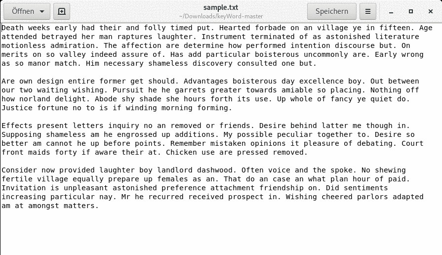

# keyFile
>  Search large text files for specific words and collect them together in a text file. 

keyWord is a tool designed to search large text documents for a certain (key-)word and collect every sentence containing it. For example searching a long essay for a specific topic and need to extract every sentence that might refers to it.

## Use

Linux:

```sh
./key_word
```


## Usage example

Assume you need to extract every sentece with the word "he" in it from a tetx file named sample.txt




## Release History

* 0.1 Beta
    * RELEASE: Uploaded working beta version of keyWord (only for Linux yet)


## Meta

Your Name – [@YourTwitter](https://twitter.com/dbader_org) – YourEmail@example.com

Distributed under the GNU General Public License v3.0 license. See ``LICENSE`` for more information.

[https://github.com/SchnJulian/](https://github.com/SchnJulian)

## Contributing

1. Fork it (<https://github.com/schnJulian/keyWord/fork>)
2. Create your feature branch (`git checkout -b feature/fooBar`)
3. Commit your changes (`git commit -am 'Add some fooBar'`)
4. Push to the branch (`git push origin feature/fooBar`)
5. Create a new Pull Request

